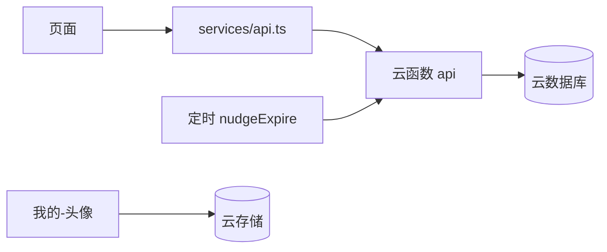

# 架构说明

配合 [STACK.md](./STACK.md) 和 [MODULES.md](./MODULES.md) 阅读。本文只写数据和接口。

## 请求链路

## 角色

| 角色 | 含义 | 第一期谁来当 |
|---|---|---|
| owner | 制定者 | 创建计划的人 |
| doer | 执行者 | 第一期等于制定者本人 |
| watcher | 关注者 | 通过分享进来的亲友 |

watcher 才能督促；doer 才能打卡和回应督促。

## 集合字段（第一期够用即可）

### users

- `openid` `nickName` `avatarUrl` `createdAt`

### plans

- `title` `description` `frequency`（目前只有 `daily`）
- `dailyTargetMinutes`
- `stages[]`：`id` `title` `targetDays` `order` `completed`
- `streak` 连续天数
- `totalDays` 累计天数
- `totalMinutes` 累计分钟
- `lastCheckinDate` 东八区 `YYYY-MM-DD`
- `createdBy` `createdAt` `updatedAt`

### plan_members

- `planId` `openid` `role` `createdAt`

### checkins

- `planId` `openid` `date` `minutes` `createdAt`

### nudges

- `planId` `planTitle` `fromOpenid` `toOpenid`
- `status`：`pending` | `done` | `delayed` | `expired`
- `deadlineAt` 发出时刻 + 30 分钟
- `delayTo` `delayLabel` 仅延迟时有
- `responseAt` `createdAt`

## 云函数 action

| action | 谁可调 | 结果 |
|---|---|---|
| login / updateProfile | 当前用户 | 用户文档 |
| getHome | 当前用户 | 我的计划 + 待回应督促 |
| createPlan | 当前用户 | 新计划，并写入 owner+doer |
| getPlan | 知道 planId 的人 | 计划、成员、最近督促 |
| checkin | doer | 更新连续/累计/阶段 |
| followPlan | 非成员 | 成为 watcher |
| sendNudge | watcher，每天每计划最多 2 次 | 新建 pending 督促 |
| getNudge / respondNudge | 执行者（或查看方） | 完成或延迟 |
| expireNudges | 定时函数 | 过期 pending |

## 打卡规则

- 同一天多次打卡：只加时长，连续天数和累计天数不加。
- 昨天打过、今天再打：`streak + 1`。
- 中断过：`streak` 从 1 重新计。
- `totalDays >= 阶段 targetDays` 时，该阶段 `completed = true`。

## 督促规则

- 倒计时 30 分钟，服务端 `deadlineAt` 为准。
- 完成：状态 `done`；若今日尚未打卡则自动打卡。
- 延迟：状态 `delayed`，延迟不是失败，不断签。
- 超时：打开首页时会清理一批；定时函数每 5 分钟再扫。
